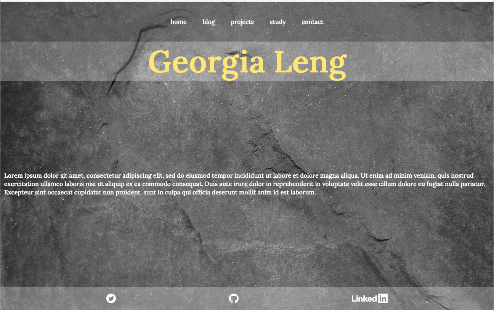
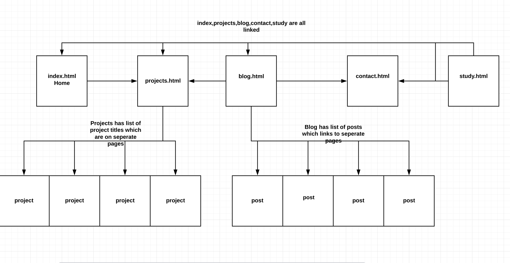

# portfolio
    
## Statement of purpose    
My portfolio is my first proper website. It aims to introduce me and showcase some of my past skills and my current learning, but primarily it's an educational challenge. One of my main goals is utilising css rules to make responsive websites that work across different device sizes.

 

 

##

## mood board
I wanted something minimal but not too sterile. I Love red and the dramatic emphasis it brings. Mostly I didn't want my page to be feminine really, which is just a personal choice. I went for Yellowy colours for header text to keep it warm.
 

## wireframes
I utilised wire frames to plan out my design. I decided I wanted to have a footer to give a cleaner tidier look, so I abandoned the scrolling componant as planned in the wireframe.
 

 
One thing I changed early into my coding was the mobile menu.
I realised pretty quickly that this design would be difficult to use on mobile. There are images below of my final mobile nav bar after deployment.
 

## Organisation
 
I used Trello to help me break up components into smaller tasks. This helped me prioritise.
 

## componnents

responsive nav bar (flexbox)

## page map

## responsiveness
I priroitised mobile first design
Here is my blog page viewed on mobile
 

 

 
And my mobile menu
 

## challenges
I tried to make an animated mobile menu in CSS, but I wasn't able to work it in to what I already had. This is something
I'd like to try do again in my own time.

## Testing
Acessability testing

